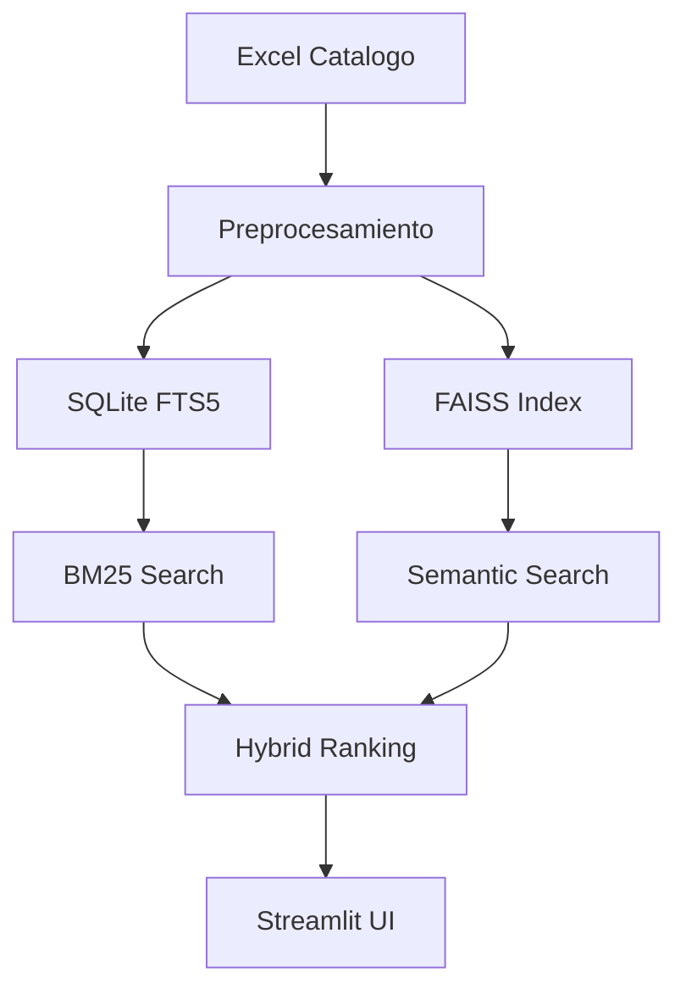

# 🔍 Semantic Product Search - Motor de Búsqueda Inteligente


> *"Sistema híbrido de búsqueda semántica que entiende el lenguaje natural para encontrar productos relevantes"*

## 🌟 Características Principales

### 🔬 Búsqueda Híbrida Inteligente
- **🤖 Embeddings Multilingües**: Modelos SentenceTransformers para comprensión semántica
- **🔍 BM25 + FAISS**: Combinación de búsqueda textual y vectorial
- **🎯 Re-ranking**: Reordenamiento inteligente por relevancia
- **📊 Scoring**: Puntuación 0-100 con explicaciones de coincidencia

### 🚀 Instalación Rápida
```bash
pip install -r requirements.txt
```
### ⚙️ Configuración
```bash
python build_index.py

# Ejecucion de App
streamlit run app.py
streamlit run app.py --browser.serverAddress=localhost
 ````

### 💻 Stack Tecnológico Avanzado

