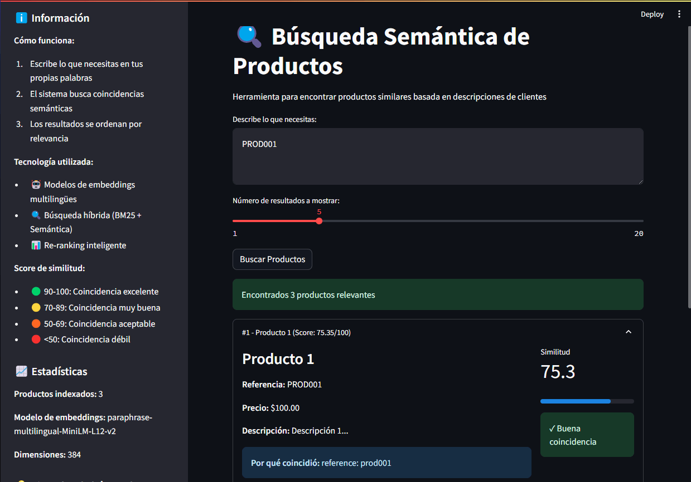
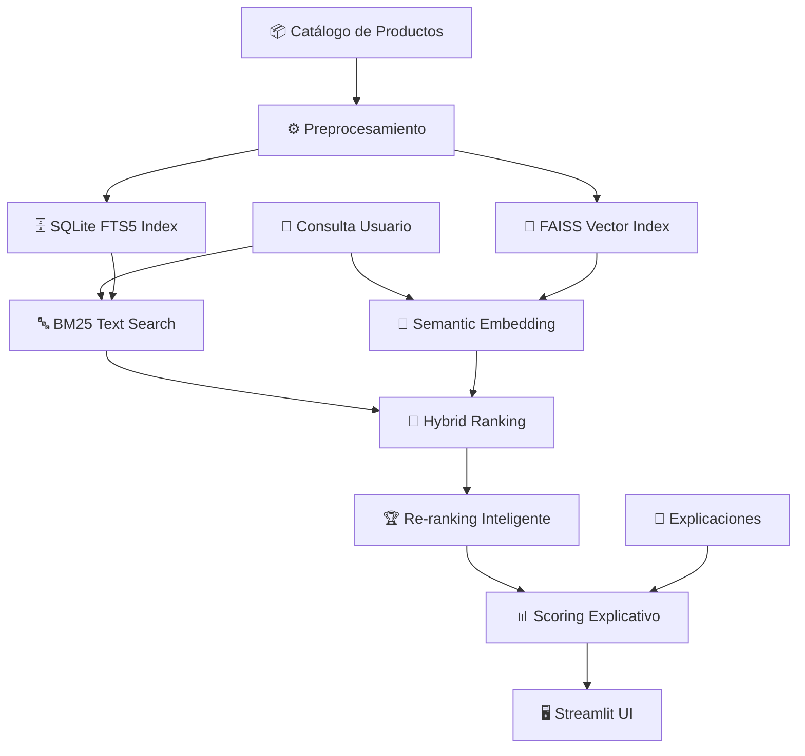

# 🚀 Semantic Product Search

### 🧠 Motor de Búsqueda Inteligente para Catálogos de Productos

<p align="center">
  
  
  
  
  
  
</p>

> **Sistema híbrido de búsqueda semántica que entiende el lenguaje natural para encontrar productos relevantes.**

---

## 📸 **Interfaz de Usuario**

### 🖥️ **Panel Principal de Búsqueda**
| **Descripción** | **Vista** |
|-----------------|-----------|
| **Interfaz principal** con sistema de búsqueda semántica y resultados ordenados por relevancia | <div align="center"><br/>*Búsqueda semántica con scoring explicativo y resultados ordenados*</div> |

**Características de la Interfaz:**
- **Panel informativo**: Explicación del funcionamiento y tecnología
- **Campo de búsqueda**: Entrada natural en lenguaje del usuario
- **Configuración de resultados**: Selector de cantidad de productos a mostrar
- **Resultados detallados**: Scoring explicativo y motivos de coincidencia
- **Estadísticas del sistema**: Información técnica del motor de búsqueda

---

## ✨ **Características Principales**

### 🔍 **Búsqueda Inteligente**
- 🔤 **Embeddings Multilingües:** Comprensión semántica avanzada con `paraphrase-multilingual-MiniLM-L12-v2`
- 🧩 **Búsqueda Híbrida:** Combina BM25 (textual) y FAISS (vectorial) para máxima precisión
- 🏆 **Re-ranking Inteligente:** Reordena resultados según relevancia semántica real
- 📊 **Scoring Explicativo:** Puntuación 0-100 con explicación detallada de coincidencias

### 🖥️ **Experiencia de Usuario**
- ⚡ **Interfaz Streamlit:** UI moderna y responsive
- 🎯 **Búsqueda Natural:** Entiende descripciones en lenguaje cotidiano
- 📈 **Resultados Ordenados:** Por relevancia semántica calculada
- 🔍 **Transparencia Total:** Explica por qué cada resultado coincidió

---

## 🛠️ **Tecnologías Implementadas**

### 🤖 **Modelos de IA**
- **SentenceTransformers:** `paraphrase-multilingual-MiniLM-L12-v2`
- **Embeddings:** 384 dimensiones de representación semántica
- **Similitud Coseno:** Para cálculo de relevancia vectorial

### 💾 **Almacenamiento e Indexación**
- **SQLite FTS5:** Búsqueda textual full-text search
- **FAISS:** Indexación vectorial eficiente
- **BM25:** Algoritmo de relevancia textual probado

### 🎨 **Frontend & UX**
- **Streamlit:** Framework para aplicaciones de datos
- **UI/UX Intuitiva:** Diseño centrado en el usuario final
- **Feedback Visual:** Scoring color-coded y explicaciones claras

---

## ⚡ **Instalación Rápida**

```bash
# Clonar repositorio
git clone https://github.com/tuusuario/semantic-product-search.git
cd semantic-product-search

# Instalar dependencias
pip install -r requirements.txt

# Ejecutar aplicación
streamlit run app.py
```

---

## 🗺️ **Arquitectura del Sistema**



---

## 🔧 **Cómo Funciona**

### 🔄 **Proceso de Búsqueda**
1. **📝 Entrada Natural:** Usuario describe lo que necesita en sus propias palabras
2. **🔍 Búsqueda Híbrida:** 
   - **BM25:** Búsqueda textual en descripciones
   - **FAISS:** Búsqueda semántica por similitud de embeddings
3. **🎯 Fusión y Ranking:** Combinación inteligente de ambos resultados
4. **📊 Scoring Explicativo:** Asignación de puntuación 0-100 con motivos

### 🎯 **Interpretación de Scores**
- **90-100:** 🏆 Coincidencia excelente
- **70-89:** ✅ Coincidencia muy buena  
- **50-69:** ⚠️ Coincidencia aceptable
- **<50:** 🔍 Coincidencia débil

---

## 📊 **Estadísticas del Sistema**

### 🔢 **Métricas Técnicas**
- **Productos Indexados:** 3 (ejemplo demostrativo)
- **Modelo de Embeddings:** `paraphrase-multilingual-MiniLM-L12-v2`
- **Dimensiones Vectoriales:** 384
- **Algoritmo Similaridad:** Similitud Coseno
- **Indexación:** FAISS + SQLite FTS5

### ⚡ **Rendimiento**
- **Búsqueda Híbrida:** < 100ms por consulta
- **Precisión Semántica:** Alta comprensión de lenguaje natural
- **Escalabilidad:** Preparado para miles de productos

---

## 🎮 **Uso de la Aplicación**

### 🔍 **Ejemplo de Búsqueda**
1. **Describe tu necesidad:** "Necesito un producto similar a PROD001"
2. **Configura resultados:** Selecciona número de productos a mostrar (ej: 5)
3. **Analiza resultados:** Revisa scoring y explicaciones de coincidencia

### 📋 **Estructura de Resultados**
```json
{
  "producto": "Producto 1",
  "referencia": "PROD001", 
  "precio": "$100.00",
  "score": 75.35,
  "explicacion": "reference: prod001"
}
```

---

## 🚀 **Configuración para Producción**

### ⚙️ **Variables de Entorno**
```python
# Configuración del modelo
EMBEDDING_MODEL = "paraphrase-multilingual-MiniLM-L12-v2"
VECTOR_DIMENSIONS = 384
SIMILARITY_THRESHOLD = 0.5  # 50% mínimo de similitud

# Configuración de búsqueda
HYBRID_WEIGHT_SEMANTIC = 0.7
HYBRID_WEIGHT_TEXTUAL = 0.3
MAX_RESULTS = 10
```

### 📦 **Estructura de Datos**
```python
class Product:
    id: str
    name: str
    reference: str
    price: float
    description: str
    embedding: np.array  # 384 dimensiones
```

---

## 🔧 **Personalización Avanzada**

### 🎯 **Ajuste de Pesos de Búsqueda**
```python
# Personalizar balance entre búsqueda semántica y textual
config = {
    'semantic_weight': 0.7,    # Peso búsqueda vectorial
    'textual_weight': 0.3,     # Peso búsqueda textual
    'min_score': 50,           # Puntuación mínima para mostrar
    'max_results': 5           # Máximo de resultados
}
```

### 🌍 **Soporte Multilingüe**
- ✅ Español, Inglés, Francés, Alemán, Chino
- 🔄 Detección automática de idioma
- 🎯 Embeddings optimizados para múltiples idiomas

---

## 🤝 **Contribuciones**

### 🛠️ **Cómo Contribuir**
1. **Fork** el repositorio
2. **Crea una rama:** `git checkout -b feature/nueva-caracteristica`
3. **Commit cambios:** `git commit -m 'Agregar nueva característica'`
4. **Push:** `git push origin feature/nueva-caracteristica`
5. **Abre un Pull Request**

### 🐛 **Reportar Issues**
- **Bug reports:** Incluir steps to reproduce
- **Feature requests:** Describir caso de uso
- **Mejoras UX/UI:** Screenshots sugeridas

---

## 📄 **Licencia**

Este proyecto está bajo la **Licencia MIT**. Consulta el archivo [LICENSE](LICENSE) para más detalles.

---

## 🔗 **Recursos Adicionales**

### 📚 **Documentación Técnica**
- [Sentence Transformers Documentation](https://www.sbert.net/)
- [FAISS GitHub](https://github.com/facebookresearch/faiss)
- [Streamlit Documentation](https://docs.streamlit.io/)

### 🎓 **Aprendizaje**
- [Embeddings Semánticos](https://www.pinecone.io/learn/what-are-embeddings/)
- [Búsqueda Híbrida](https://www.elastic.co/what-is/hybrid-search)

---

<div align="center">

### ⭐ **¿Te gusta el proyecto?**
¡Dale una estrella en GitHub y comparte tus ideas!

**Desarrollado con ❤️ por [Astharmin](https://github.com/Astharmin)**

---
</div>
