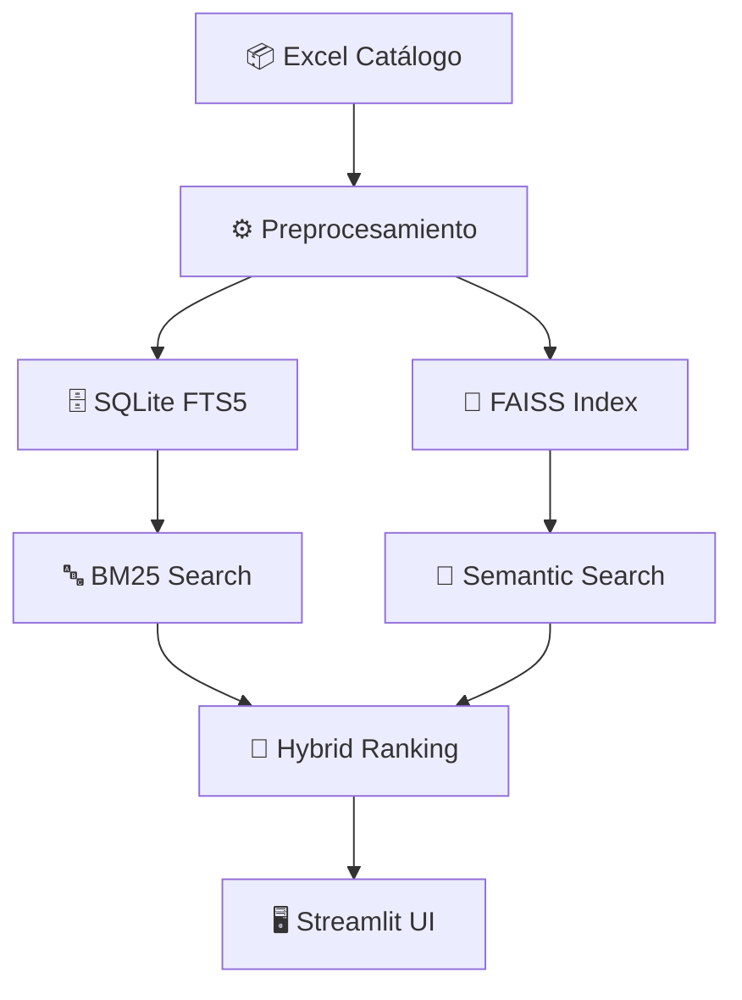

# 🚀 Semantic Product Search

### 🧠 Motor de Búsqueda Inteligente para Catálogos de Productos

<p align="center">
  
  
  
  
  
  
</p>

> **Sistema híbrido de búsqueda semántica que entiende el lenguaje natural para encontrar productos relevantes.**

---

## ✨ Características Principales

- 🔤 **Embeddings Multilingües:** Comprensión semántica avanzada con SentenceTransformers.
- 🧩 **Búsqueda Híbrida:** Combina BM25 (texto) y FAISS (vectorial) para máxima precisión.
- 🏆 **Re-ranking Inteligente:** Reordena resultados según relevancia real.
- 📊 **Scoring Explicativo:** Puntuación 0-100 con explicación de coincidencias.
- 🖥️ **Interfaz Intuitiva:** UI moderna y fácil de usar con Streamlit.

---

## ⚡ Instalación Rápida

```bash
pip install -r requirements.txt
```

---

## 🗺️ Arquitectura del Sistema



---

## 📚 Licencia

Este proyecto está bajo la licencia MIT.

---

## 🤝 Contribuciones

¡Las contribuciones son bienvenidas! Siéntete libre de abrir issues o pull requests.

---